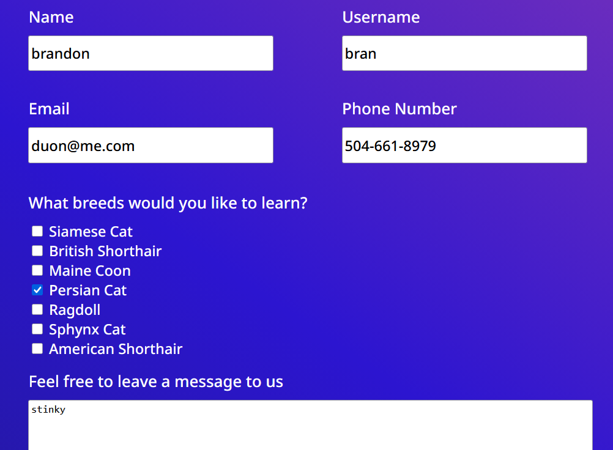

## Code Review Exercise

Write your code review here in markdown format.

### Issue #1: Accessibility

The issue, why this is an issue, and the solution:

The accessibility issue is the "empty button" issue, meaning that the button is either empty or has no text value text. A button should always have a value, but sometimes, we might use a glyphicon such as "x" to indicate this button is meant to close the modal. To fix this issue, we can add an "aria-label" attribute. It's also a good idea to add the "title" attribute, which will show the "title" of the image as a tooltip when the user hovers over the image.


Initial code:

```html
<button class="close-popup-button">
  <i class="fa-solid fa-xmark"></i>
</button>
```

Updated code:

```html
<button
  class="close-popup-button"
  title="close popup button"
  aria-label="close popup button"
>
  <i class="fa-solid fa-xmark"></i>
</button>
```

### Issue #2: Form

The issue, why this is an issue, and the solution:

The form presently does not serve any function and is decorative. Given that the form should take a data input from the user it should at least place the data into a text file to be read. Additionally the reset feature does not work.



Initial code:

```html
</form>
      <div
        class="form space-evenly-distributed-row-container form-buttons-container"
      >
        <input class="form-button" type="submit" value="submit" />
        <input class="form-button" type="reset" value="reset" />
      </div>
```

Updated code:

```html
<div class="form space-evenly-distributed-row-container form-buttons-container">
        <input class="form-button" type="submit" value="submit" />
        <input class="form-button" type="reset" value="reset" />
      </div>
    </form> </div>
```

### Issue #3: Broken crashing Modal Popups

The issue, why this is an issue, and the solution:

In index.js, the event listener responsible for closing the modal popups relies on a hardcoded structure: event.currentTarget.parentElement.parentElement.parentElement. If a user clicks directly on the icon (<i class="fa-solid fa-xmark"></i>) instead of the outer button spacing, event.target becomes the <i> tag.

Initial code:

```javascript
for (const closePopupButton of closePopupButtons) {
  closePopupButton.addEventListener("click", (event) => {
    console.log(event.target);
    const popupSection =
      event.currentTarget.parentElement.parentElement.parentElement;
    popupSection.style.style.display = "none";
  });
}
```

Updated code:

```javascript
for (const closePopupButton of closePopupButtons) {
  closePopupButton.addEventListener("click", (event) => {
    console.log(event.target);
    const popupSection =
      event.currentTarget.parentElement.parentElement.parentElement;
    popupSection.style.style.display = "none";
  });
}
```
